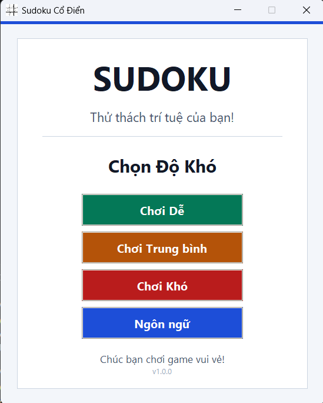
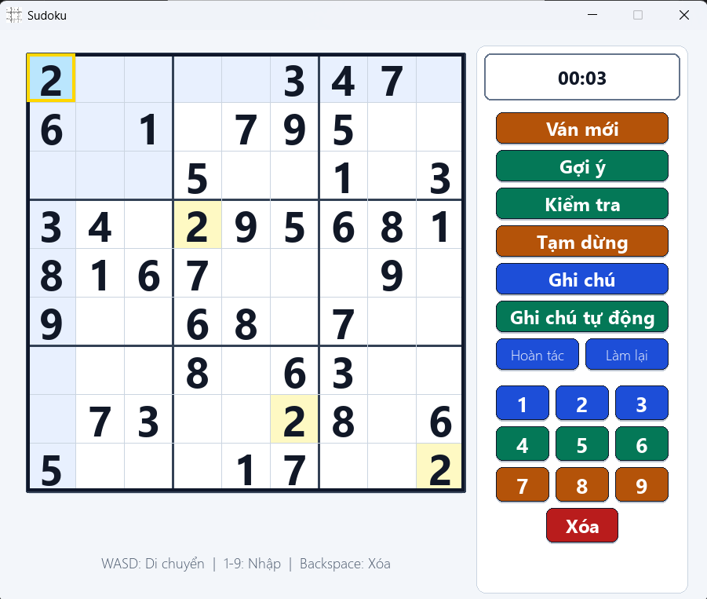
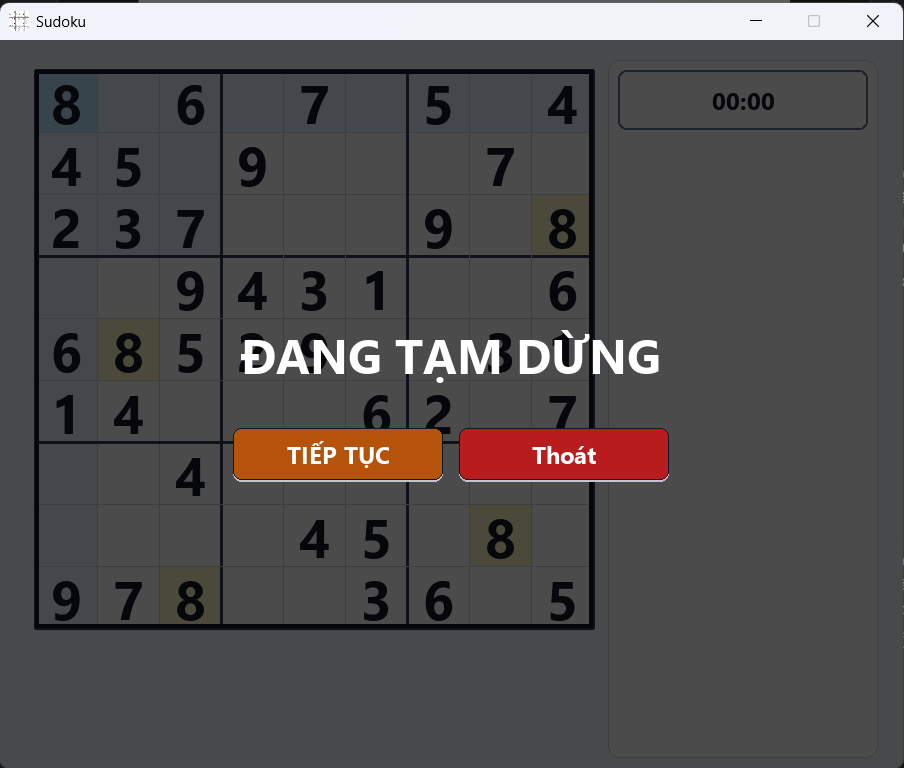
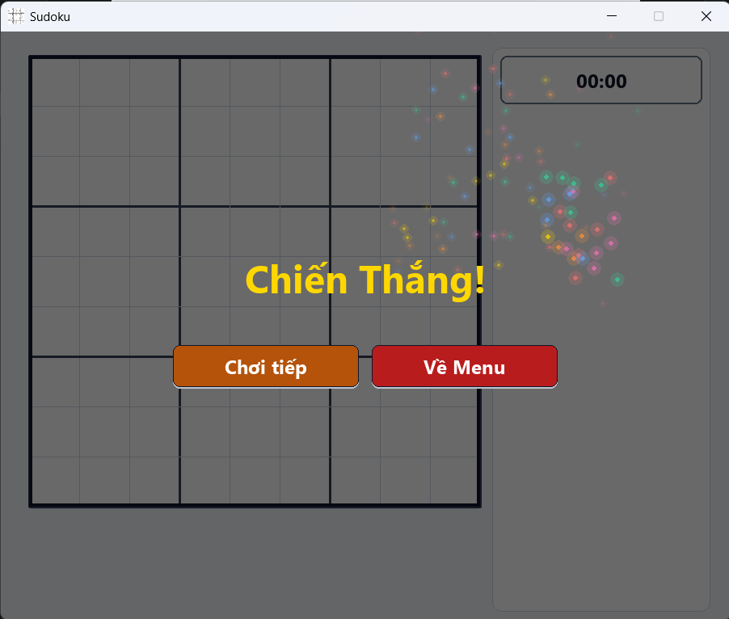

# Sudoku

[](https://www.python.org/)
[](https://www.pygame.org/)
[](LICENSE)

Đây là dự án game Sudoku được xây dựng bằng Python và `pygame`, tập trung vào trải nghiệm chơi trực quan, bố cục rõ ràng và các tính năng hỗ trợ đủ tốt để người chơi có thể giải đố thoải mái ngay trên giao diện desktop.

Thay vì chỉ là một bảng Sudoku đơn giản, dự án được tổ chức như một ứng dụng hoàn chỉnh với menu mở đầu, nhiều mức độ khó, đồng hồ thời gian, ghi chú, gợi ý, hoàn tác, làm lại, tạm dừng và màn hình chiến thắng riêng.

## Tổng quan dự án

Dự án này phù hợp cho 3 mục đích:

- chơi Sudoku với giao diện đẹp và dễ dùng
- học cách tổ chức một project Python có giao diện bằng `pygame`
- dùng làm đồ án, project cá nhân hoặc dự án trưng bày trên GitHub

Mã nguồn được tách thành các phần riêng cho logic sinh bảng, kiểm tra hợp lệ, vòng lặp game, giao diện hiển thị và cấu hình ngôn ngữ. Nhờ vậy, dự án dễ đọc, dễ mở rộng và dễ chỉnh sửa hơn.

## Xem trước giao diện

### 1. Màn hình menu

<div align="center">
  
</div>

Đây là màn hình đầu tiên khi mở game.

Chi tiết các thành phần:

- Tiêu đề `SUDOKU` được đặt lớn ở giữa để tạo điểm nhấn chính.
- Dòng mô tả `Thử thách trí tuệ của bạn!` giúp phần mở đầu có cảm giác như một sản phẩm hoàn chỉnh thay vì chỉ là màn hình chọn mode.
- Khu vực `Chọn Độ Khó` chia rõ 3 mức:
  - `Chơi Dễ`
  - `Chơi Trung bình`
  - `Chơi Khó`
- Nút `Ngôn ngữ` cho phép đổi ngôn ngữ hiển thị trong game.
- Phần chân trang có lời chúc và phiên bản `v1.0.0`, giúp giao diện gọn và có cảm giác chỉn chu hơn.

Màn hình này đóng vai trò điều hướng nhanh trước khi vào ván chơi, đồng thời tạo ấn tượng đầu tiên khá tốt cho người xem repo.

### 2. Màn hình chơi chính

<div align="center">
  
</div>

Đây là giao diện quan trọng nhất của game, nơi toàn bộ trải nghiệm chơi được diễn ra.

Chi tiết từng khu vực:

- Bên trái là bảng Sudoku `9x9`, được chia rõ bằng các đường đậm cho từng khối `3x3`.
- Ô đang chọn có viền nổi bật màu vàng, giúp người chơi biết chính xác vị trí đang thao tác.
- Các ô cùng hàng, cùng cột hoặc liên quan được tô nền nhẹ để tăng khả năng tập trung khi giải đố.
- Một số ô có nền nhấn màu vàng nhạt, hỗ trợ việc theo dõi số hoặc trạng thái kiểm tra.
- Các con số cố định và số người chơi nhập được hiển thị rõ, kích thước lớn, dễ nhìn.

Khu vực điều khiển bên phải:

- Đồng hồ ở phía trên hiển thị thời gian chơi hiện tại.
- Các nút chức năng chính gồm:
  - `Ván mới`
  - `Gợi ý`
  - `Kiểm tra`
  - `Tạm dừng`
  - `Ghi chú`
  - `Ghi chú tự động`
- Bên dưới là hai nút:
  - `Hoàn tác`
  - `Làm lại`
- Cụm số từ `1` đến `9` cho phép nhập nhanh trực tiếp bằng chuột.
- Nút `Xóa` dùng để xóa giá trị trong ô hiện tại.

Thanh hướng dẫn cuối màn hình:

- `WASD: Di chuyển`
- `1-9: Nhập`
- `Backspace: Xóa`

Thiết kế này cho thấy game không chỉ tập trung vào logic mà còn chú ý đến khả năng thao tác thực tế của người chơi.

### 3. Màn hình tạm dừng

<div align="center">
  
</div>

Khi người chơi nhấn tạm dừng hoặc `Esc`, game sẽ hiển thị một lớp phủ mờ lên toàn bộ màn hình chơi.

Chi tiết giao diện:

- Phần nền được làm tối để người chơi biết game đang bị khóa thao tác.
- Tiêu đề lớn `ĐANG TẠM DỪNG` nằm giữa màn hình, rất dễ nhận biết.
- Hai nút hành động chính:
  - `TIẾP TỤC`
  - `Thoát`
- Bảng Sudoku phía sau vẫn còn hiển thị mờ, giúp giữ ngữ cảnh của ván đang chơi.

Điểm mạnh của màn hình này là người chơi không bị mất cảm giác đang ở đâu trong ván cờ, nhưng vẫn tách rõ trạng thái tạm dừng với trạng thái chơi bình thường.

### 4. Màn hình chiến thắng

<div align="center">
  
</div>

Khi giải xong bảng Sudoku, game chuyển sang trạng thái chiến thắng với hiệu ứng ăn mừng trực quan.

Chi tiết giao diện:

- Dòng chữ `Chiến Thắng!` nổi bật ở trung tâm màn hình.
- Hiệu ứng hạt màu ở phía bên phải tạo cảm giác vui mắt và tăng tính hoàn thiện cho game.
- Hai nút điều hướng sau khi thắng:
  - `Chơi tiếp`
  - `Về Menu`
- Nền game phía sau vẫn được giữ lại theo kiểu làm mờ, giúp chuyển trạng thái mượt hơn thay vì cắt cảnh đột ngột.

Đây là một chi tiết nhỏ nhưng rất có giá trị nếu dùng dự án này để trình bày trên GitHub hoặc làm sản phẩm học tập, vì nó cho thấy game có vòng đời giao diện đầy đủ.

## Điểm nổi bật

- Giao diện desktop rõ ràng, dễ nhìn
- Có menu chọn độ khó riêng trước khi chơi
- Hỗ trợ `ghi chú`, `gợi ý`, `kiểm tra`, `hoàn tác`, `làm lại`
- Điều khiển bằng cả chuột lẫn bàn phím
- Có trạng thái `tạm dừng` và `chiến thắng` riêng
- Có hỗ trợ nội dung tiếng Việt và tiếng Anh

## Tính năng chính

### Lối chơi

- Tạo bảng Sudoku ngẫu nhiên theo 3 mức độ khó: `easy`, `medium`, `hard`
- Kiểm tra tính hợp lệ của số được nhập
- Gợi ý số đúng cho ô đang chọn
- Tự động điền ghi chú khả dĩ
- Kiểm tra thắng khi bảng hiện tại trùng với lời giải

### Điều khiển

- Chuột: chọn ô và bấm các nút chức năng
- `W`, `A`, `S`, `D` hoặc phím mũi tên: di chuyển ô chọn
- `1` đến `9`: nhập số
- `Backspace` hoặc `Delete`: xóa ô
- `Esc`: tạm dừng / tiếp tục

### Cấu trúc mã nguồn

- `main.py`: điểm khởi đầu để chạy ứng dụng
- `game.py`: quản lý vòng lặp game, trạng thái và sự kiện
- `logic.py`: xử lý sinh bảng Sudoku và kiểm tra logic
- `ui.py`: vẽ giao diện, bố cục và tương tác
- `config.py`: quản lý text hiển thị và ngôn ngữ

## Cấu trúc thư mục

```text
SUDOKU/
|-- main.py
|-- game.py
|-- logic.py
|-- ui.py
|-- config.py
|-- menu.py
|-- requirements.txt
|-- Picture/
|   |-- menu.png
|   |-- game.png
|   |-- stop.png
|   |-- win.png
|   `-- SUDOKU.ico
|-- assets/
|   `-- preview/
`-- README.md
```

## Cài đặt nhanh

### Yêu cầu

- Python `3.8+`
- `pip`

### Cài thư viện

```bash
pip install -r requirements.txt
```

### Chạy game

```bash
python main.py
```

## Vì sao repo này phù hợp để đưa lên GitHub

- Có giao diện thật và ảnh minh họa rõ ràng
- Có phân tách module tương đối sạch
- Có thể dùng làm project học tập, đồ án hoặc sản phẩm portfolio
- Có sẵn nền tảng để phát triển thêm như lưu ván chơi, xếp hạng thời gian hoặc đóng gói thành file chạy độc lập

## Hướng phát triển tiếp

- Tối ưu thuật toán sinh bảng để đảm bảo lời giải duy nhất tốt hơn
- Lưu và tải lại trạng thái ván chơi
- Ghi nhận thời gian chơi tốt nhất
- Đóng gói thành bản `.exe` cho Windows
- Bổ sung ảnh GIF hoặc video demo thực tế

## Giấy phép

Dự án được phát hành theo [giấy phép MIT](LICENSE).
