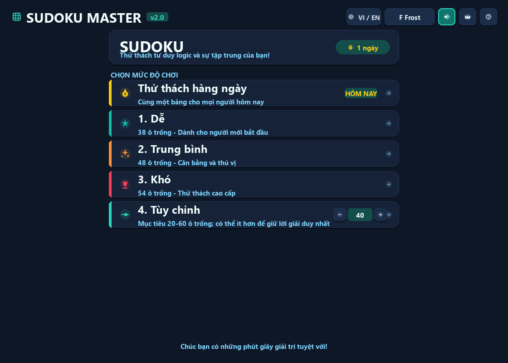
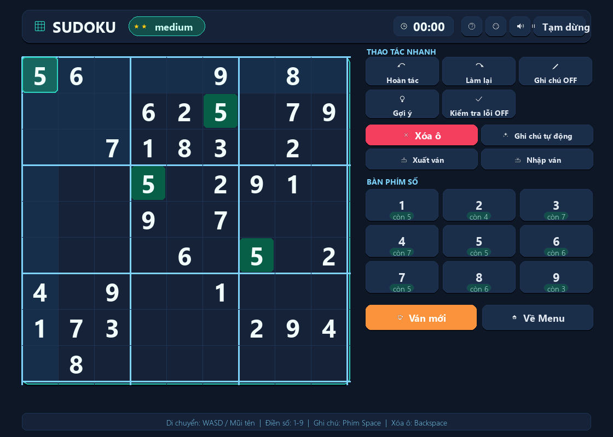
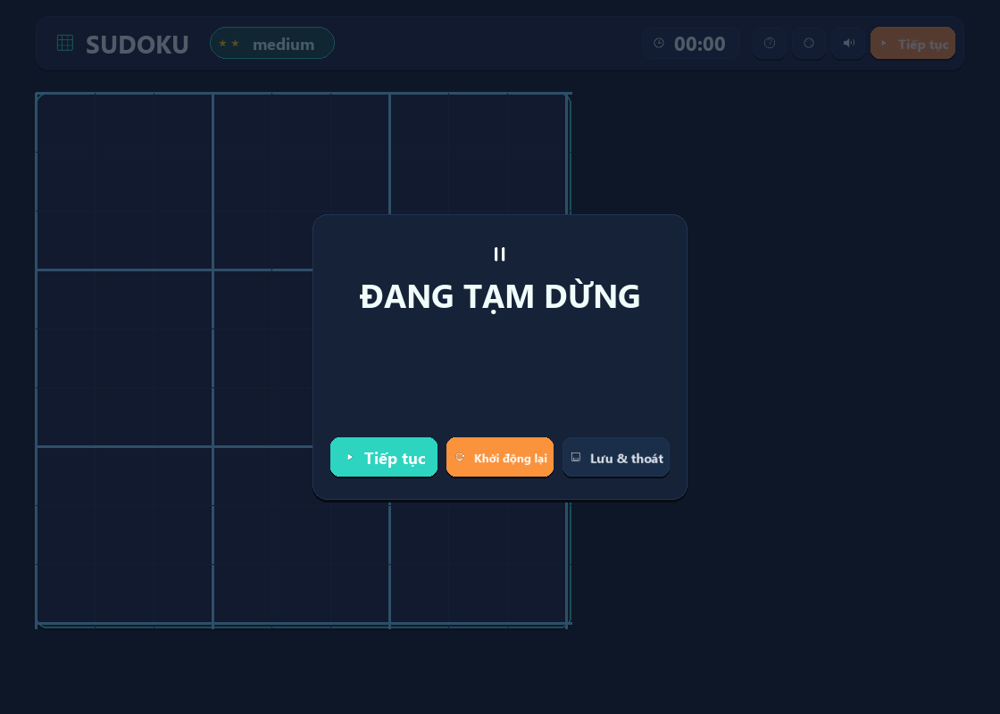
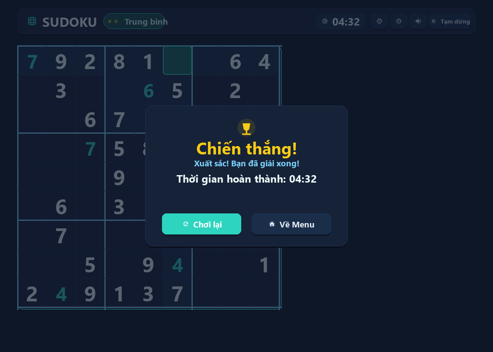

# Sudoku Master

> Game Sudoku desktop viết bằng Python và Pygame · Phiên bản **2.0.0**

[](https://www.python.org/)
[](https://www.pygame.org/)
[](LICENSE)

Sudoku Master là dự án game chạy trực tiếp trên máy tính, hướng đến trải nghiệm chơi gọn gàng, dễ đọc và thuận tiện để khám phá mã nguồn. Ứng dụng có menu, bàn Sudoku, nhiều mức độ khó, lưu ván cục bộ, bảng xếp hạng và hai ngôn ngữ giao diện: **Tiếng Việt** và **English**.

Đây là ứng dụng desktop ngoại tuyến: dự án không có máy chủ, API web, cơ sở dữ liệu hay đồng bộ đám mây. Dữ liệu trò chơi được lưu dưới dạng JSON trên máy người chơi. Nhật ký thay đổi nằm trong [CHANGELOG.md](CHANGELOG.md).

## Ảnh giao diện

Các ảnh dưới đây là ảnh chụp từ giao diện hiện tại trong `assets/preview/`.

### Menu chính

<div align="center">
  
</div>

### Bàn chơi

<div align="center">
  
</div>

### Tạm dừng và chiến thắng

<div align="center">
  
  
</div>

## Tính năng

- Tạo Sudoku ở các chế độ Dễ, Trung bình, Khó, Thử thách hằng ngày và Tùy chỉnh.
- Bảo đảm puzzle được tạo hoặc nhập có đúng một lời giải; chế độ tùy chỉnh có thể tạo ít ô trống hơn mục tiêu để giữ điều kiện này.
- Daily Challenge được xác định theo ngày UTC, nên mọi người chơi cùng một bảng trong cùng ngày UTC.
- Ghi chú thủ công, tự điền ghi chú khả dĩ, gợi ý, xóa ô, kiểm tra lỗi, hoàn tác và làm lại (tối đa 200 trạng thái).
- Chọn ô và thao tác bằng chuột hoặc bàn phím; có modal trợ giúp phím tắt.
- Tạm dừng, chơi lại, lưu và quay về menu; tự lưu ván đang chơi để tiếp tục sau khi mở lại ứng dụng.
- Lưu thời gian tốt nhất và TOP 10 theo từng chế độ trên máy hiện tại. Khi thời gian thắng đủ điều kiện vào TOP 10, game cho phép nhập tên người chơi.
- Bốn giao diện màu, hiệu ứng chuyển động nhẹ và âm thanh có thể bật/tắt.
- Hai ngôn ngữ giao diện: Tiếng Việt có dấu và English; lựa chọn ngôn ngữ và âm thanh được lưu cục bộ giữa các lần chạy.
- Nhập puzzle từ JSON đã xuất hoặc chuỗi gồm 81 chữ số; xuất puzzle vào clipboard. Các hộp thoại này cần Tcl/Tk.

## Điều khiển

| Thao tác | Phím |
| --- | --- |
| Di chuyển ô chọn | `W`, `A`, `S`, `D` hoặc phím mũi tên |
| Điền số | `1`–`9` |
| Xóa ô đang chọn | `Backspace`, `Delete` hoặc `Kp0` |
| Bật/tắt ghi chú | `Space` hoặc `N` |
| Hoàn tác | `Ctrl+Z` |
| Làm lại | `Ctrl+Y` hoặc `Ctrl+Shift+Z` |
| Tạm dừng / tiếp tục | `Esc` hoặc `P` |
| Mở / đóng trợ giúp | `F1` |
| Điều hướng menu | `Tab` / `Shift+Tab`, chọn bằng `Enter` hoặc `Space` |

Bạn cũng có thể dùng chuột để chọn ô và bấm các nút trên giao diện. Game làm nổi bật số trùng trong hàng, cột hoặc khối; tùy chọn **Kiểm tra lỗi** làm nổi bật thêm các số không khớp lời giải.

## Bố cục mã nguồn

```text
SUDOKU/
├── .github/workflows/ci.yml  # Kiểm thử, lint, type-check, quét bảo mật, build và release
├── assets/
│   ├── icons/                 # Icon ứng dụng
│   └── preview/               # Ảnh chụp giao diện trong README
├── tests/                    # Unit, persistence, integration và UI smoke tests
├── ui/                       # Giao diện Pygame
│   ├── board.py              # Render bàn Sudoku và animation
│   ├── colors.py             # Bảng màu và quản lý theme
│   ├── drawing.py            # Nút, thẻ và thành phần vẽ dùng chung
│   ├── fonts.py              # Font và fallback theo hệ điều hành
│   ├── geometry.py           # Kích thước, vị trí và hitbox
│   ├── icons.py              # Icon vector và hạt hiệu ứng
│   ├── menu.py               # Menu chính
│   ├── modals.py             # Modal trợ giúp, tạm dừng, chiến thắng, xếp hạng
│   ├── screen.py             # Khởi tạo cửa sổ, DPI và icon
│   ├── sidebar.py            # Các nút và bàn phím số
│   └── view.py               # Ghép các thành phần thành màn hình chơi
├── config.py                 # Chuỗi giao diện tiếng Việt / tiếng Anh
├── error_handling.py         # Ghi log và decorator ghi nhận lỗi
├── game.py                   # Trạng thái Sudoku, sự kiện và bộ điều khiển ứng dụng
├── logic.py                  # Sinh, giải, xác thực và nhập/xuất puzzle
├── main.py                   # Điểm vào ứng dụng và smoke test bản đóng gói
├── persistence.py            # Lưu game, thống kê, kỷ lục và bảng xếp hạng JSON
├── sounds.py                 # Tạo và phát âm thanh bằng Pygame
├── build.bat / build.spec    # Đóng gói ứng dụng bằng PyInstaller
├── pyproject.toml            # Metadata, dependency và cấu hình công cụ
├── requirements.txt          # Dependency tối thiểu để chạy game
├── .gitignore                # Loại trừ cache, dữ liệu cá nhân và artifact build
├── .pre-commit-config.yaml   # Kiểm tra trước khi commit
├── .secrets.baseline         # Baseline detect-secrets
├── CHANGELOG.md              # Lịch sử thay đổi
├── LICENSE                   # Giấy phép MIT
└── README.md                 # Tài liệu dự án
```

### Luồng hoạt động

`main.py` khởi chạy `AppController` trong `game.py`. Bộ điều khiển chuyển giữa menu, ván chơi, trợ giúp và bảng xếp hạng. `GameState` gọi `logic.py` để sinh/xác thực bảng và `persistence.py` để lưu trạng thái; các màn hình được chia thành module trong `ui/`. Cấu hình ngôn ngữ nằm trong `config.py`, còn hiệu ứng âm thanh do `sounds.py` tạo trực tiếp, không cần file âm thanh ngoài.

## Yêu cầu và cài đặt

- Python **3.10–3.13**. CI kiểm tra cả bốn phiên bản này.
- Cửa sổ game có kích thước cố định `1120 × 800`; nên dùng màn hình có độ phân giải tối thiểu bằng kích thước này.
- `pip` để cài dependency.
- Tcl/Tk để dùng hộp thoại nhập/xuất puzzle và để tạo bản đóng gói đầy đủ. Trên một số bản Linux cần cài thêm gói `python3-tk`.

Cài dependency chạy game:

```bash
python -m pip install -r requirements.txt
```

Cài thêm công cụ phát triển và kiểm thử:

```bash
python -m pip install -e ".[dev]"
```

Chạy ứng dụng:

```bash
python main.py
```

## Dữ liệu và quyền riêng tư

Dữ liệu runtime được lưu cục bộ trong thư mục riêng theo hệ điều hành:

| Hệ điều hành | Thư mục mặc định |
| --- | --- |
| Windows | `%LOCALAPPDATA%\SudokuMaster` |
| macOS | `~/Library/Application Support/SudokuMaster` |
| Linux | `$XDG_DATA_HOME/SudokuMaster`, hoặc `~/.local/share/SudokuMaster` nếu biến chưa đặt |

Trong đó có thể có ván đang chơi, kỷ lục, thống kê Daily Challenge, bảng xếp hạng và log. Ở lần chạy đầu, các file dữ liệu cũ trong thư mục dự án được sao chép sang vị trí runtime; dấu mốc di chuyển ngăn dữ liệu cũ bị khôi phục lại sau khi người chơi xóa ván. Biến môi trường `SUDOKU_DATA_DIR` ghi đè thư mục mặc định, hữu ích khi kiểm thử hoặc chạy bản portable. Game không gửi các dữ liệu này lên mạng.

## Kiểm tra chất lượng

Chạy các kiểm tra cục bộ sau để xác minh mã nguồn và giao diện:

```bash
python -m pytest -q
python -m pytest --cov=. --cov-report=term-missing
python -m ruff check .
python -m ruff format --check .
python -m mypy . --ignore-missing-imports
python -m compileall -q .
python main.py --smoke-test
```

`--smoke-test` khởi tạo giao diện ở chế độ headless, kiểm tra Tcl/Tk và render các màn hình cơ bản; dữ liệu thử nghiệm được ghi vào thư mục tạm. GitHub Actions chạy test có coverage, Ruff, mypy, quét `pip-audit`/secret, build Windows/Linux và smoke-test các file thực thi.

Pipeline CI chạy test, Ruff, mypy, `pip-audit` và `detect-secrets` trên Linux. Build Windows và Linux tạo ứng dụng bằng PyInstaller rồi chạy smoke test cho file thực thi. CI Summary tổng hợp kết quả; tag `v*` tạo GitHub Release với artifact Windows và Linux. Build macOS chưa nằm trong CI và chưa được xác minh.

## Đóng gói

Cài PyInstaller rồi tạo bản thực thi cho hệ điều hành hiện tại:

```bash
python -m pip install -e ".[build]"
pyinstaller build.spec --clean
```

Trên Windows có thể dùng `build.bat`. Artifact nằm trong `dist/`; không đưa thư mục build hoặc file thực thi sinh ra vào Git. Mỗi hệ điều hành cần build riêng trên hệ điều hành tương ứng.

## Giới hạn hiện tại

- Đây là game desktop một người chơi, lưu dữ liệu cục bộ; chưa có tài khoản, multiplayer, đồng bộ online hoặc dịch vụ backend.
- Kích thước cửa sổ hiện cố định; layout được thiết kế cho `1120 × 800`.
- Màn hình thống kê tổng quan chưa được triển khai; hiện có bảng TOP 10 và các số liệu Daily Challenge.
- Pipeline phát hành tự động hiện cung cấp artifact Windows và Linux, chưa có bản macOS.

## Giấy phép

Dự án được phát hành theo [giấy phép MIT](LICENSE).
